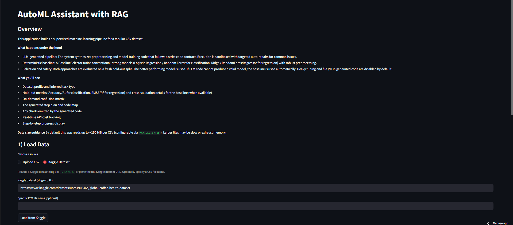
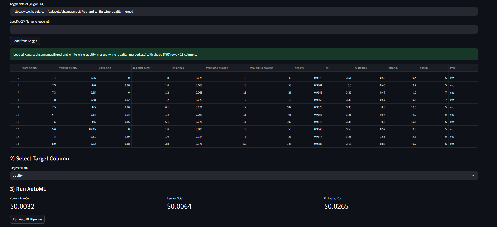
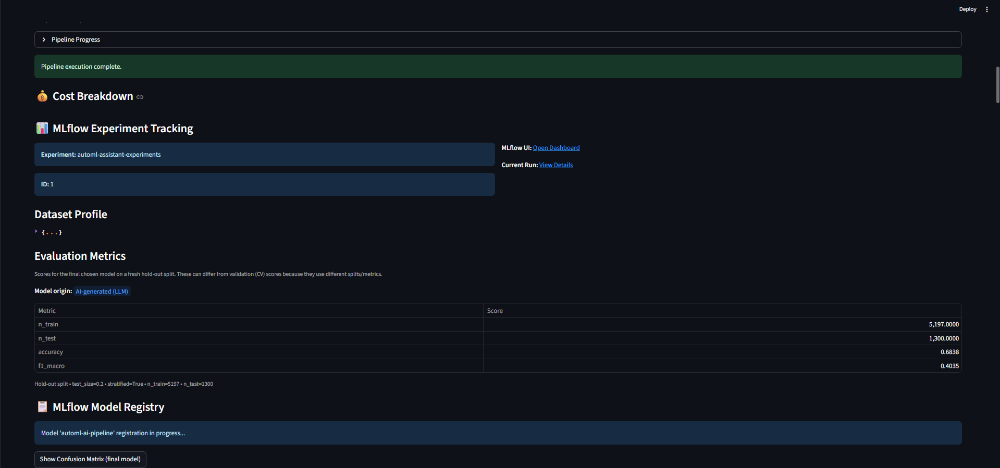
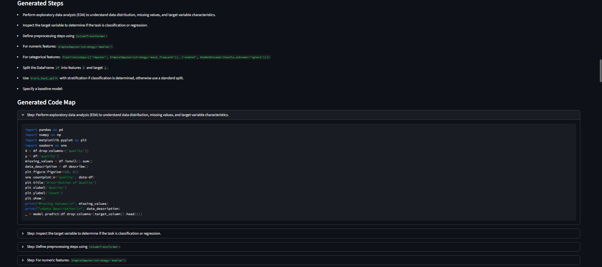
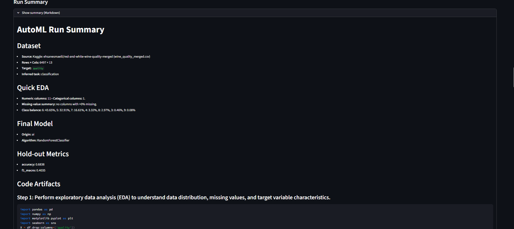

# AutoML Assistant (Tabular) — with RAG + Safe Execution

Streamlit app that builds a full ML pipeline for a CSV (or Kaggle dataset) end-to-end:
1) profile data
2) plan steps
3)  retrieve rules/examples with RAG (Chroma) →  
4) LLM generates code
5) run safely with guards
6) evaluate & pick best model →  
7) produce a polished Markdown + PDF report (with plots).

---

##  Features
- **One-click AutoML for tabular data** (classification/regression)
- **RAG grounding with Chroma DB** to keep the LLM on-policy
- **Safety first**: sandboxed execution, I/O & tuning guards
- **Deterministic baselines** (LogReg/RandomForest or Ridge/RFR) as fallback
- **Professional outputs**: Markdown and PDF (ReportLab), with embedded/linked plots
- **Kaggle loader** (slug/URL) in addition to CSV upload

---

##  Repository structure (high level)


## How to use this

-Load data: upload a CSV or paste a Kaggle slug/URL.

-Pick target: choose the target column.

-Run AutoML: the app will:

-Profile the dataset and infer task

-Plan a pipeline (EDA → preprocessing → modeling → evaluation)

-Retrieve rules with RAG to ground the LLM

-Generate code for each step (with strict contracts)

-Safely execute the code; train an AI model

-Train baselines if needed and select the winner on a fresh hold-out

-Review results: profile JSON, metrics table, plots, and cleaned code map

-Export: download run_summary.md and run_summary.pdf


##  Project Structure

```
automl-assistant/
├─ app.py                     # Streamlit UI (upload/Kaggle loader, target pick, run, results, downloads)
├─ execution.py               # CLI/terminal runner (optional; run the graph headlessly)
├─ ingest_rules.py            # Builds the Chroma vector store from the markdown files in rules/
├─ main_runner.py             # Batch/headless entrypoint that mirrors the Streamlit run
├─ prompts.py                 # Prompt templates + policy/contract text used by LLM codegen
├─ llm_codegen.py             # Helper to generate & clean Python code blocks with the LLM
│
├─ agents/                    # LangGraph “nodes” (each file is a focused agent)
│  ├─ __init__.py
│  ├─ graph_orchestrator.py   # Wires the whole flow; defines create_graph()
│  ├─ intake_agent.py         # Seeds/validates state (df/target) before other steps
│  ├─ profile_agent.py        # Schema, dtypes, missingness, task inference, class balance
│  ├─ planning_agent.py       # High-level plan (EDA → preprocess → model → eval → export)
│  ├─ retrieval_agent.py      # RAG via Chroma; fetches policy/rule snippets for the plan
│  ├─ pipeline_builder.py     # Turns plan+RAG into code map; also configures a baseline
│  ├─ execution_agent.py      # Safe execution of generated code; collects plots; sets _origin='ai'
│  ├─ evaluation_agent.py     # Hold-out metrics; picks best of AI vs baseline
│  └─ summary_agent.py        # Final Markdown summary (includes inline/linked visuals)
│
├─ rules/                     # Curated policy/rule notes ingested by ingest_rules.py
│  ├─ regression.md
│  ├─ regression_metrics.md
│  ├─ report_structure.md
│  └─ … (more .md rule files)
│
├─ .env                       # Environment variables 
└─ README.md                  # Project documentation

```
---

##  Screenshots

**Landing Page**  


**Dataset Upload**


**Results**  


**Code Generation**  



**Generated Summary**  


---

## What’s happening under the hood (short)

-LangGraph orchestrates modular “agents” (intake → profile → planning → retrieval → pipeline_build → execution → evaluation → summary).

-RAG with Chroma: your rules/patterns/examples are embedded and retrieved to guide the LLM (consistent, policy-compliant code).

-Safe execution: generated code runs with restricted builtins and honors ALLOW_IO, ALLOW_TUNING, ALLOWED_DATA_DIR.

-Baselines: if the LLM code fails or under-performs, a deterministic BaselineSelector (LogisticRegression/RandomForest or Ridge/RFR) is trained and may win.

-Reporting: summary_agent.py builds Markdown (plots inline for UI); app.py sanitizes for download and ReportLab converts to PDF with page-sized images.

## Customization 

-Rules & RAG: edit rules_data.json (add imputation/encoding/plotting policies, modeling patterns), then run ingest_rules.py.

-Prompts: tighten or extend templates in prompts.py.

-Baselines: adjust algorithms/metrics in pipeline_builder.py / evaluation_agent.py.

-PDF: tweak margins/styles in the PDF section of app.py.

---
### Configure Environment Variables
in the .env file  add your keys:
```
OPENAI_API_KEY

KAGGLE_USERNAME

KAGGLE_KEY
```
---

### Run the Application
```
streamlit run app.py
```

#### License

This project is licensed under the MIT License.
