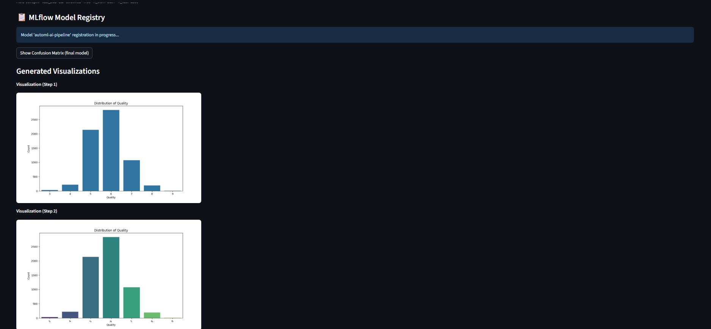

# AutoML Assistant using Langgraph — with RAG + Safe Execution

Streamlit app that builds a full ML pipeline for a CSV (or Kaggle dataset) end-to-end:
1) profile data
2) plan steps
3)  retrieve rules/examples with RAG (Chroma) →  
4) LLM generates code
5) run safely with guards
6) evaluate & pick best model →  
7) produce a polished Markdown + PDF report (with plots).

---

##  Features
-**One-click AutoML** for tabular data supporting classification and regression tasks

-**RAG grounding** with ChromaDB to keep LLM generations policy-compliant

-**Safety-first** execution with sandboxed code execution and I/O guards

-Deterministic baselines using LogisticRegression/RandomForest or Ridge/RandomForestRegressor as fallback

-**Professional outputs** including Markdown and PDF reports with embedded visualizations

-**Kaggle dataset loader** supporting both slug/URL input and CSV upload

-**MLflow experiment tracking** with complete pipeline observability

-**DVC data versioning** using **S3 backend** for ML rules storage

-**AWS cloud deployment with EC2 and S3 integration**

-**MCP protocol implementation** for external tool integration

-**CI/CD automation with GitHub Actions** and DockerHub publishing


---

##  Repository structure (high level)


## How to use this

**Load Data**: Upload a CSV file or paste a Kaggle dataset slug/URL
**Pick Target**: Choose the target column for prediction
**Run AutoML**: The application will automatically:

Profile the dataset and infer task type
Plan a pipeline following EDA → preprocessing → modeling → evaluation workflow
Retrieve relevant rules with RAG to ground the LLM
Generate code for each step with strict contracts
Safely execute the code and train an AI model
Train baseline models if needed and select the winner on fresh hold-out data

Review Results: Examine profile JSON, metrics tables, plots, and cleaned code map
Export: Download run_summary.md and run_summary.pdf with complete results

##  Project Structure

```
automl-assistant/
├─ app.py                     # Streamlit UI with upload, target selection, and results
├─ mcp_server.py             # Model Control Protocol JSON-RPC server
├─ mlflow_config.py          # MLflow experiment tracking configuration
├─ cost_tracker.py           # OpenAI API usage monitoring
├─ ingest_rules.py           # ChromaDB vector store builder from markdown rules
├─ main_runner.py            # Batch processing entrypoint
├─ prompts.py                # LLM prompt templates and policy contracts
├─ llm_codegen.py            # Python code generation and cleaning utilities
├─ docker-compose.yml        # Multi-service orchestration
├─ .dvc/                     # DVC configuration for data versioning
├─ rules.dvc                 # DVC-tracked ML rules directory
├─ .github/workflows/        # CI/CD automation pipeline
│
├─ agents/                   # LangGraph agent implementations
│  ├─ graph_orchestrator.py  # Workflow coordination and MLflow integration
│  ├─ profile_agent.py       # Dataset schema and task inference
│  ├─ planning_agent.py      # Pipeline step generation
│  ├─ retrieval_agent.py     # RAG knowledge base queries
│  ├─ execution_agent.py     # Code generation with LLM
│  ├─ pipeline_builder.py    # Safe code execution and baseline training
│  ├─ evaluation_agent.py    # Model evaluation and selection
│  └─ summary_agent.py       # Report generation with embedded plots
│
└─ rules/                    # ML knowledge base (DVC-tracked)
   ├─ regression.md
   ├─ classification.md
   ├─ preprocessing.md
   └─ ...                    # Additional rule files

```
---
##  Screenshots

**Landing Page**  


**Dataset Upload**


**Results**  




**Code Generation**  


**Generated Summary**  


---

---
## Technology Implementation

**LLM Integration**: OpenAI GPT-4o generates custom pipeline code with strict execution contracts
**Vector Database**: ChromaDB stores and retrieves ML best practices for context-aware code generation
**Experiment Tracking**: MLflow logs all pipeline runs, parameters, metrics, and artifacts with model registry
**Data Versioning**: DVC manages 43 ML rule documents stored in AWS S3 with cross-environment sync
**Cloud Infrastructure**: AWS EC2 deployment with proper security groups and S3 integration
**Containerization**: Docker and Docker Compose for multi-service application deployment
**CI/CD Pipeline**: GitHub Actions automates testing, building, security scanning, and DockerHub publishing
**API Protocols**: MCP implementation provides JSON-RPC interface for external tool integration

---

---

## Environment Configuration
Create .env file with required credentials:

OPENAI_API_KEY=your_openai_api_key
KAGGLE_USERNAME=your_kaggle_username  
KAGGLE_KEY=your_kaggle_api_key
AWS_ACCESS_KEY_ID=your_aws_access_key
AWS_SECRET_ACCESS_KEY=your_aws_secret_key
AWS_DEFAULT_REGION=us-east-1
MLFLOW_TRACKING_URI=http://localhost:5000


## Configure DVC for data versioning:
```
dvc remote add -d s3remote s3://your-bucket-name
dvc remote modify s3remote region us-east-1
dvc pull
```
---

## Local Development:
```
git clone https://github.com/Theepankumargandhi/automl-langgraph-assistant.git

```
## cd automl-langgraph-assistant

### Requiremetns
```
pip install -r requirements.txt
```

### Run the Application
```
streamlit run app.py
``

---

---
## Customization

**RAG Rules**: create rules/ directory, then run python ingest_rules.py to update the vector database
**Prompts**: Modify templates in prompts.py to adjust LLM behavior and code generation contracts
**Baselines**: Configure algorithms and metrics in pipeline_builder.py and evaluation_agent.py
**Reporting**: Adjust PDF styling and layout in the report generation section of summary_agent.py


## What’s happening under the hood (short)

-LangGraph orchestrates modular “agents” (intake → profile → planning → retrieval → pipeline_build → execution → evaluation → summary).

-RAG with Chroma: your rules/patterns/examples are embedded and retrieved to guide the LLM (consistent, policy-compliant code).

-Safe execution: generated code runs with restricted builtins and honors ALLOW_IO, ALLOW_TUNING, ALLOWED_DATA_DIR.

-Baselines: if the LLM code fails or under-performs, a deterministic BaselineSelector (LogisticRegression/RandomForest or Ridge/RFR) is trained and may win.

-Reporting: summary_agent.py builds Markdown (plots inline for UI); app.py sanitizes for download and ReportLab converts to PDF with page-sized images.


---

`

#### License

This project is licensed under the MIT License.
